# Balanceo de cargas

En esta actividad vamos configurar una máquina con PfSense para que actúe como un balanceador de cargas de dos redes con acceso a internet.

## Configuración Máquina Virtual para PfSense.

Tenemos que tener 3 interfaces de red para simular un balanceo de carga con el PfSense.

  *  La primera tarjeta de red en Adaptador Puente.

  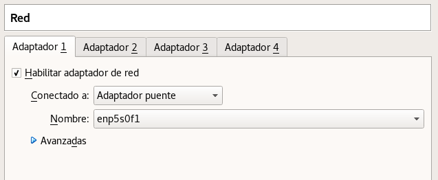

  *  La segunda tarjeta de red Interna.

  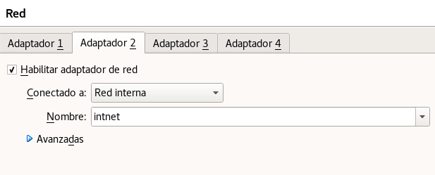

  *  La tercera tarjeta de red Adaptador Puente

  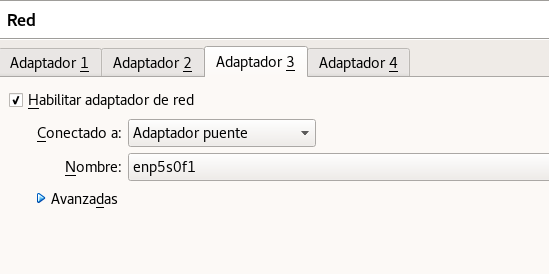

Ya tenemos en la máquina virtual con 3 tarjetas de red.

## Configurar Las tarjeta de red.

En la práctica anterior teniamos configurado dos tarjeta de red, por lo tanto solo vamos a configurar la tercera tarjeta de red.

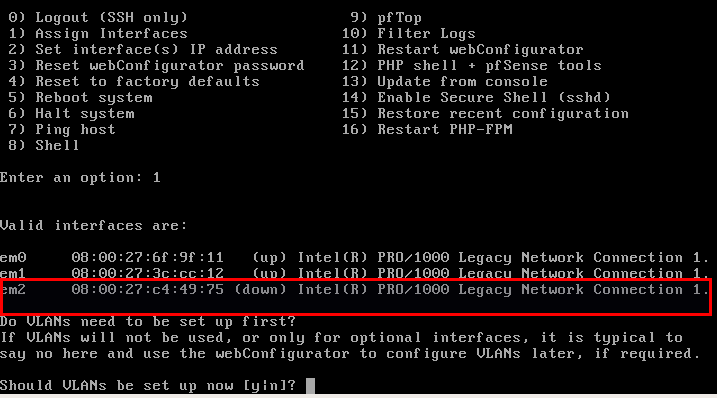

Vamos a configurar para que em0 y em2 sean para el adaptador puente.

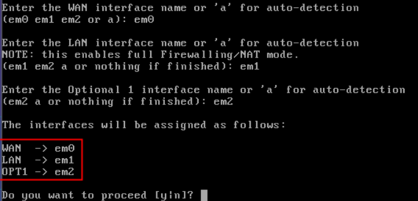

em1 como comprobamos es para la LAN Interna.

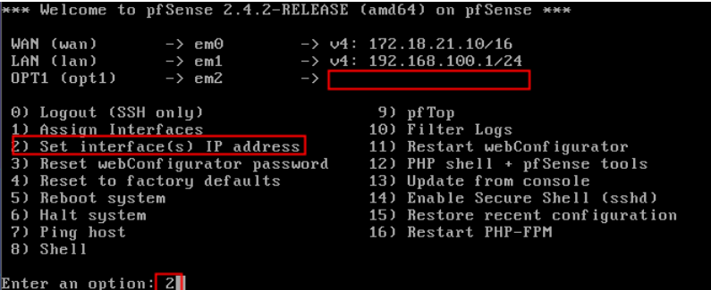

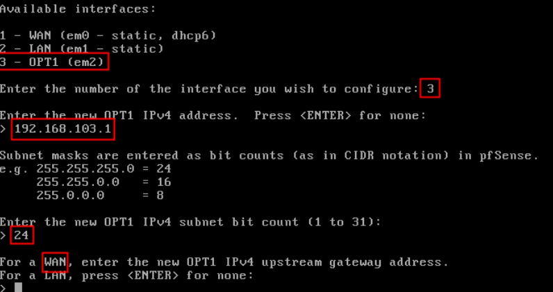

Ya tenemos las 3 interfaces configuradas.

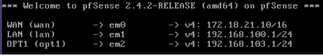

Configuramos en el Equipo cliente la interfaz de red con la siguiente dirección IP.

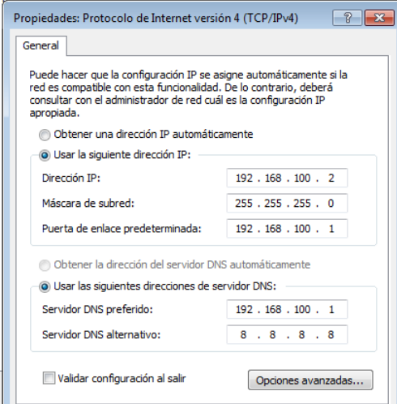

Nos conectamos al pfsense desde un navegador.

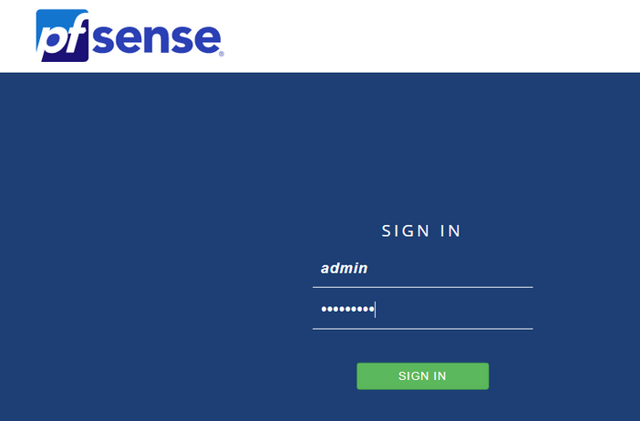

Entramos al pfsense.

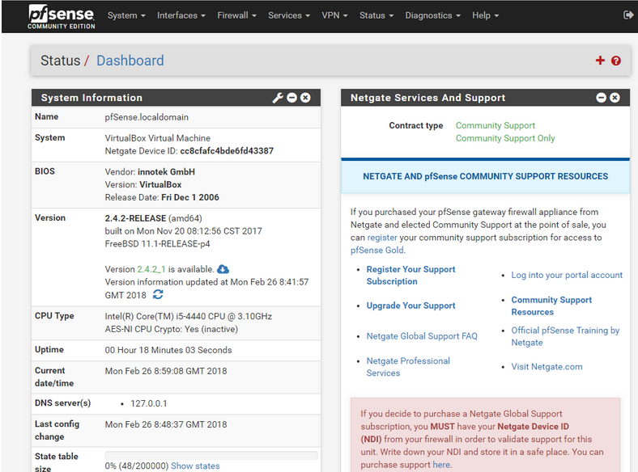

Vamos a System y Routing.

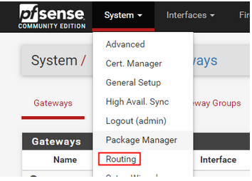

Comprobamos nuestras interfaces.

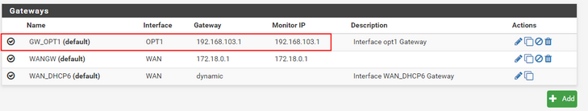

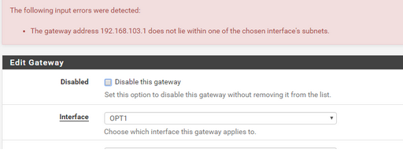

Ahora vamos a crear un grupo y dentro vamos a meter las dos interfaces para el balanceo de carga.

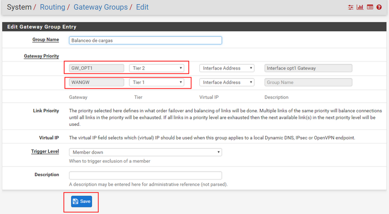

Lo llamamos balanceo.

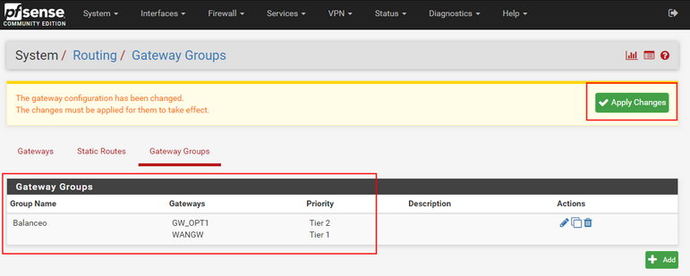

Vamos a Firewall y reglas.

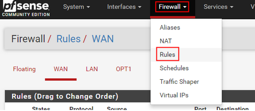

Vamos a la interfaz de LAN y le damos editar y vamos a Gateway y seleccionamos el grupo creado.

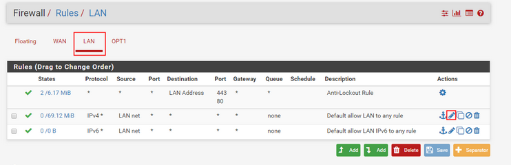

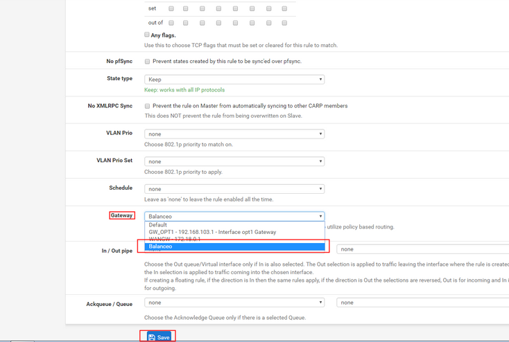

Comprobamos en Gateway que ahora nuestra puerta de enlace es el grupo de balanceo de carga, es decir las dos interfaces.

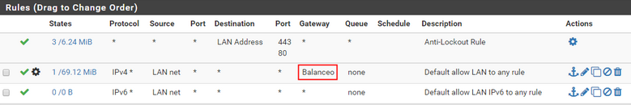

Realizamos una comprobación para saber como va su trama.

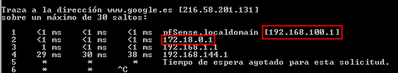
